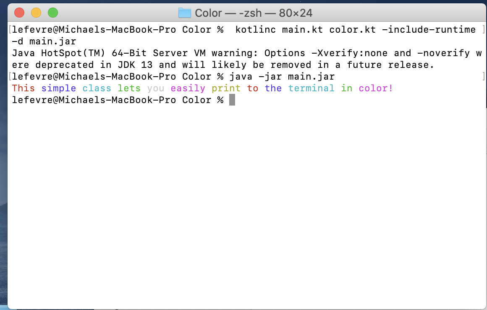

# Color Class

## Overview

This class makes it easy to print to the terminal with colored text.

## Development Environment
This was made using Kotlin version 1.4.10

## Execution
I use the command line to compile my code, but feel free to compile however you wish. To use the class and the example main file, type:

`kotlinc main.kt color.kt -include-runtime -d main.jar` to compile.

Then type: `java -jar main.jar` to run.

## Screenshot

## Helpful Websites
[Kotlin Main Site](https://kotlinlang.org)
